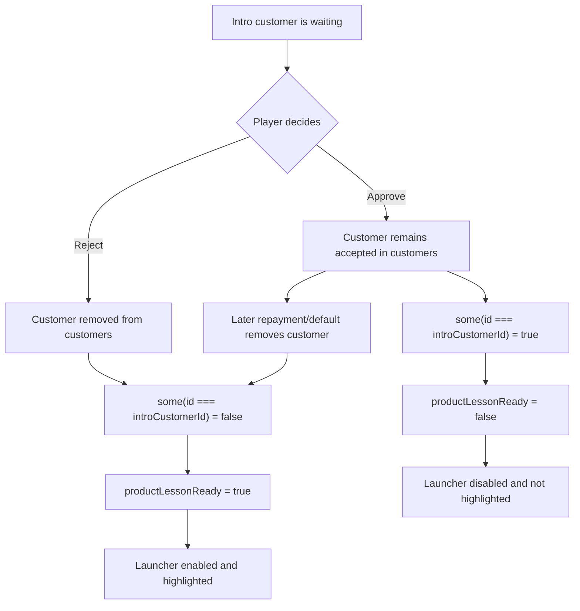
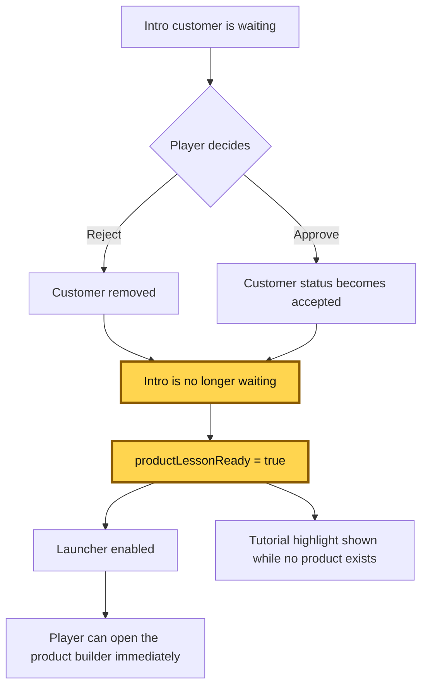

# Product tutorial gate problem

## Problem

`productLessonReady` is intended to become `true` after the stage's intro
customer has been dealt with. However, the current condition only checks
whether that customer still exists in `customers`:

```tsx
const productLessonReady =
  hasProductGoal &&
  !customers.some((customer) => customer.id === world.config.introCustomerId);
```

An accepted customer is not removed immediately. Accepted customers remain in
`world.customers` while their loan is outstanding, and are removed only when
the loan is repaid or defaults. Therefore, approving the intro customer leaves
the condition false even though the player's intro decision is complete.

This affects the product launcher because both of these values depend on
`productLessonReady`:

```tsx
const highlightProductButton = productLessonReady && products.length === 0;
disabled={!productLessonReady && products.length === 0}
```

As a result, after approval the launcher remains disabled and the tutorial
highlight does not appear. In the current stage-two flow, a later default can
open the builder through a separate event handler, but that is delayed and does
not make the launcher state correct after the intro decision.

## AS-IS

The code treats “intro customer no longer exists” as equivalent to “intro
decision is complete.” Those are different lifecycle states.



The approval path is the problematic one: the product tutorial is blocked
until a later financial event changes the customer's lifecycle state.

## TO-BE

Determine readiness from the intro customer's status, or from an explicit
decision flag, rather than from array membership. For example, if readiness
means “the intro customer is no longer waiting,” the condition can be modeled
as:

```tsx
const introCustomer = customers.find(
  (customer) => customer.id === world.config.introCustomerId,
);
const productLessonReady =
  hasProductGoal && introCustomer?.status !== "waiting";
```

This preserves the intended behavior for rejection (the customer is removed)
and approval (the customer remains, but is no longer waiting).



The yellow nodes are the changed logic: readiness is derived from the intro
customer no longer being `waiting`, and that state now enables the product
lesson immediately after approval or rejection.

## Expected invariant

For a stage with a product goal:

> Once the intro customer has been rejected or approved, the product launcher
> should no longer be disabled solely because the intro customer is still
> present in the outstanding-loan list.
